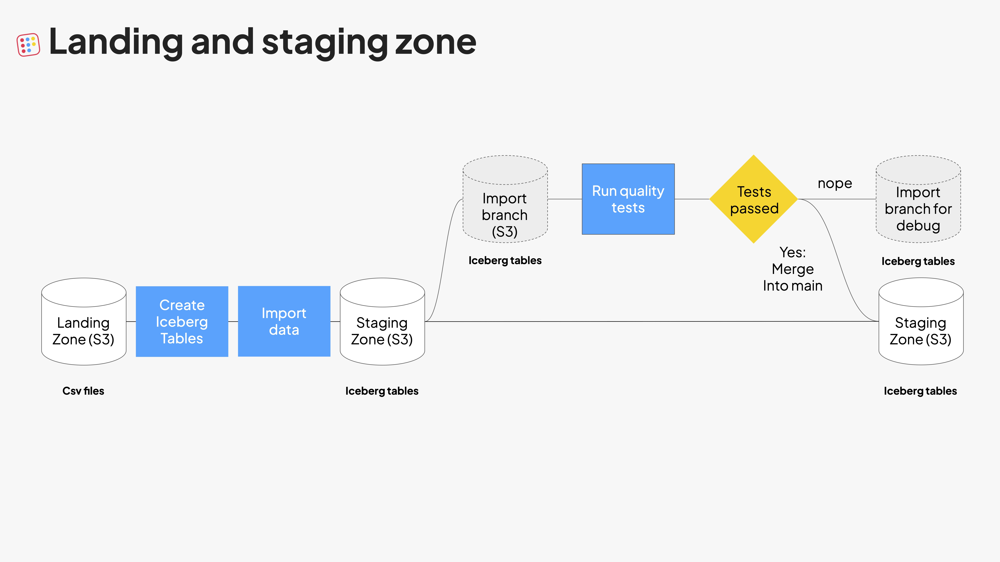
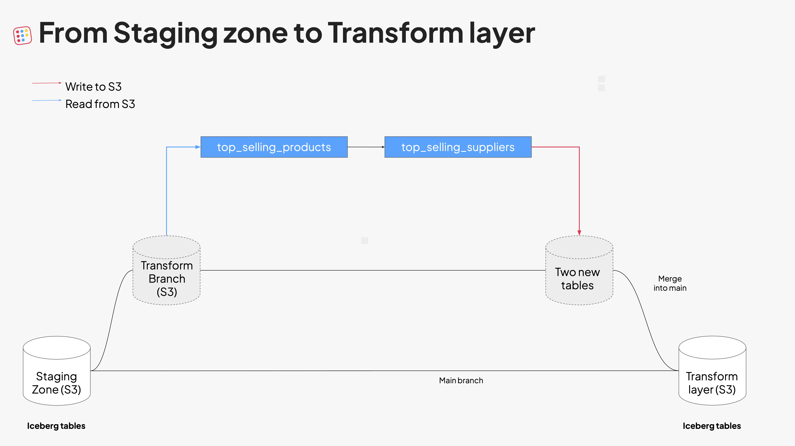

# From zero to data hero (with Bauplan), Data Camp Edition

## Overview 
This project implements a standard landing / staging / transformation architecture in Bauplan (sometimes called "Medallion"). In particular, you will learn:

* the simplest way to _safely_ load "files" (in S3) into "tables": tables (but not files) can be branched, queries and governed, and they are the foundation of any serious data workload;
* the simplest way to _safely_ go from source tables to refined data assets for business outcomes, e.g. tables to be visualized in BI tools, or dataset to be used by data scientists in their notebooks. This is accomplished writing pipelines, which are DAG of SQL and Python functions chained together.

We distinguish between an interactive, manual flow, in which most operations are done through the Bauplan CLI, and an automated, scripted flow, in which the same operations are done through a Python script, using the Python SDK (which exposes nice, typed Python objects through no-nonsense APIs.)

### Desired architecture at a glance 

- Landing Zone (S3)
  - Archive and debugging store 
  - Parquet and csv files

- Staging Zone
  - Loading parquet to Iceberg
  - Raw data in Iceberg format.
  - data quality testing

- Transform layer
  - data pipelines
  - transformation and aggregation

## Setup

### Python environment
We recommend using [uv](https://docs.astral.sh/uv/guides/install-python/) to manage the dependencies:

```bash
uv sync
```

Additional dependencies (on top of `bauplan`) are only necessary to run the code in `notebooks` at the end.

### Bauplan
* [Join](https://app.bauplanlabs.com/sign-up) the bauplan sandbox, create your username and API key.
* Complete do the 3-min [tutorial](https://docs.bauplanlabs.com/en/latest/tutorial/index.html) to get familiar with the platform.

## From landing to transformation: interactive mode

### Step 0

You need to set up your landing zone with some initial files, which is outside the scope of Bauplan (typically, your application will send events to S3 buckets through Kafka or similar mechanism). To simulate this step, we will add the csv files in the `data` folder to a public repo hosted by Bauplan and connected to our public sandbox - do [this](https://www.loom.com/share/9421861af03a4199bb1e75de16eb6ef8?sid=27e5689b-b43d-494d-a10c-96a438846bf1) for the three files in `data`, corresponding to three sample tables, `product_data`, `supplier_sku_lookup`, `supplier_sku_lookup`, and copy the S3 path that the app shows (this is were the files now are). Do not run the commands displayed there just yet!

### Step 1: landing to staging

Once the data landed in S3, we move *from files to tables*, using a Git-like pattern (a.k.a. Write-Audit-Publish): we create a data branch to sandbox our operations and import the table there. For the `product_data` table for example, this looks like this (remember to replace the placeholders with your values):

```bash
bauplan checkout main
bauplan checkout -b <YOUR_USERNAME>.demodatacamp
bauplan namespace create <YOUR_USERNAME>_data_camp
bauplan table create \
    --search-uri s3://<URL_FROM_THE_APP>/1755359275284_demo-data-2025-02-12-product_data.csv \
    --name product_data --namespace <YOUR_USERNAME>_data_camp
bauplan table import \
    --search-uri s3://<URL_FROM_THE_APP>/1755359275284_demo-data-2025-02-12-product_data.csv \
    --name product_data --namespace <YOUR_USERNAME>_data_camp
```

Note: we use namespaces to logically group your tables together. This may or may not be needed in the real-world, depending on your use case.

To check that the data quality is what is expected, let's for example query the table and check no NULL are in the `customer_product_id` column:

```bash
bauplan query "SELECT COUNT(customer_product_id) FROM product_data WHERE customer_product_id IS NULL" --namespace <YOUR_USERNAME>_data_camp
```

If the check passes (count=0), we can "promote" the tables to the official staging zone on the `main` branch, similar to what we do with code branches in Git (your namespace will now be visible):

```bash
bauplan checkout main
bauplan branch merge <YOUR_USERNAME>.demodatacamp
bauplan namespace
```



### Step 2: staging to transformation

Once the data is in the staging zone, we can run our transformation pipelines. This is where we apply business logic to the data, such as aggregations, joins, and other transformations. The pipeline is a two step DAG in `bpln_pipeline`:

* step 1 (in SQL): build an intermediate table called `top_selling_products`;
* step 2 (in Python): build a final table called `top_selling_suppliers` that aggregates the results of the first step and enriches it with additional data from the `supplier_sku_lookup` table.

We will once again use branches to develop safely on production data, without affecting the main branch until we are ready to merge. Cd into `bpln_pipeline`, verify you are now on main with `bauplan branch`, then run the pipeline on a new branch:

```bash
cd bpln_pipeline
bauplan branch
bauplan checkout -b <YOUR_USERNAME>.transform_datacamp
bauplan run --namespace <YOUR_USERNAME>_data_camp
```



Note: we may or may not merge here, but we don't by default to showcase that artifacts on branches can immediately be used and shared inside an organization before making a final decision to merge.

### Step3 (optional): visualize final tables

If you want to explore the final datasets, we have a few options.

#### Run ad hoc queries in the CLI

```bash
bauplan query "SELECT SUM(total_supplier_revenue) AS rev FROM top_selling_suppliers" --namespace <YOUR_USERNAME>_data_camp
```

#### Use a Python notebook to explore the data

```cd notebooks
 uv marimo edit query_to_pandas.py
```

Note: make sure to the edit the notebook cells with your own variables before running.

#### Use a BI tool

You can also connect a BI tool compatible with Postgres. You can for example use a local Docker container with [Metabase] and visualize the table we just created. The configuration details for the connection to the sandbox are:

```text
host: nlb.pub.bauplanlabs.us-east-1.computing.prod.bauplanlabs.com
port: 25432
database: <YOUR_USERNAME>.transform_datacamp
user: <YOUR_USERNAME>
password: <YOUR_API_KEY>
advanced settings (for metabase): preferQueryMode=simple
```

For a video walkthrough of the setup, see this [video](https://www.loom.com/share/1ad862ca7b7a454d8d91f05b97d29490?sid=33c96084-b36b-408b-8044-c4b672b60463) - note that passwords have been edited out.

## From landing to transformation: automation mode

We now do the exact same operations, but scripted as a Python file which can be run in an automated way. This is useful for production pipelines, or for running the same operations multiple times.

```bash
cd src 
uv run automated_flow.py --namespace_suffix data_camp_auto
```

The script executes the entire logic for you: these are the _same_ steps as we did above, but now they are embedded inside a standard Python flow:

* import [the files to tables](https://github.com/BauplanLabs/from-zero-to-hero-data-camp-edition/blob/86892980861ba6ad0466a0ced06d0ed32f35d3a7/src/automated_flow.py#L20) and merge into `main` to get to a ready staging zone;
* run [the transformation pipeline](https://github.com/BauplanLabs/from-zero-to-hero-data-camp-edition/blob/86892980861ba6ad0466a0ced06d0ed32f35d3a7/src/automated_flow.py#L141) to get the final tables.

Note that we did not to rewrite a single line of business logic, nor infrastructure code: going from development to production has never been easier - this is a [video of a successful automated run](https://www.loom.com/share/2c81b8384aa04b5b8e5f0180558457d6).
